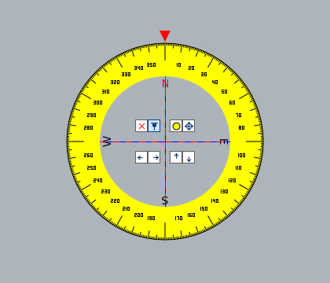
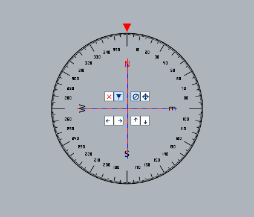

# Win桌面罗盘

Windows 桌面悬浮罗盘，采用 WPF 矢量绘制，不依赖表盘位图或外置字体文件。

- 版本：1.0.0（程序集版本 1.0.0.0）
- 作者：LmTec
- 公司：流氓工作室
- 运行环境：x86 或 x64 Windows，安装 .NET Framework 4.8。建议使用 Windows 10/11。

## 程序预览

以下为程序在中性灰画布（`#AEB4BC`）上的实际窗口截图，分别展示黄色表盘和透明表盘。灰色仅为截图背景，不是程序新增的底色；截图保持原始像素尺寸，未进行缩放。

### 黄色表盘



### 透明表盘



## 运行与分发

直接运行 `Compass x64_x86.exe`。程序默认置顶、无边框，并显示任务栏按钮。

分发时只需提供 `Compass x64_x86.exe`。图标和 DPI 清单已嵌入程序，无需随附源码、`icon.ico` 或 `app.manifest`。

程序采用 AnyCPU 编译：同一个 EXE 在 32 位 Windows 上以 x86 运行，在 64 位 Windows 上以 x64 运行，无需区分下载版本。

## 操作

- 在转盘圆面内按住鼠标左键拖动，旋转刻度盘；数字位置随盘移动，字形保持水平。
- 圆面内透明区域也拦截鼠标点击，不会穿透到下方窗口；按钮优先执行各自功能。
- 鼠标悬停在中间按钮上可查看文字提示。

按钮按屏幕从左到右排列：

| 位置 | 按钮功能 |
| --- | --- |
| 上排 | 关闭、置顶开关、圆环底色开关、拖动窗口 |
| 下排 | 左移、右移、上移、下移 |

四向移动按钮每次移动 **1 DIP（逻辑像素）**，不是调整方位角。

窗口获得键盘焦点后：

| 按键 | 功能 |
| --- | --- |
| 左 / 右方向键 | 方位角减 / 加 1 度 |
| Shift + 左 / 右方向键 | 方位角减 / 加 10 度 |
| Home | 方位角归零 |
| Esc | 关闭程序 |

## 显示与 DPI

- 窗口尺寸为 300 × 300 DIP，随系统 DPI 缩放。
- 圆环底色为不透明纯黄色，可切换隐藏；中心保留透明效果。
- 指针和红蓝等长相间的十字线固定，十字线限制在内圈内。
- 刻度数字采用 3×5 设计网格的填充矢量轮廓，不使用普通字体渲染数字，也不加载数字图片。
- 数字随 DPI 缩放，并将轮廓边缘对齐物理像素。非整数缩放比例下，字形尺寸及笔画宽度会有像素级微调。
- 方向字母使用 Tahoma 常规体；文字和边框不加粗。

## 与 Protractor.exe 的差异

本程序参考了 `Protractor.exe` 的表盘视觉风格，但并非原程序的逐像素复刻。以下比较限于表盘显示与绘制实现，不涉及按钮及外置组件功能。

| 对比项 | Protractor.exe 参考表盘 | 本程序 |
| --- | --- | --- |
| 绘制方式 | 使用内嵌的预制表盘图片，已核对 GIF 资源尺寸为 251 × 249 像素 | WPF 直接绘制几何图形和字形轮廓，不加载表盘位图 |
| 小数字 | 字形固定在图片中，顶部样本数字约为 3 × 5 像素，原尺寸下是硬像素笔画 | 参照小尺寸数字风格定义 3×5 网格矢量轮廓，不依赖外置字体文件 |
| 数字方向 | 参考图片初始状态的数字基本水平；图片本身固定了各数字方向 | 数字位置随转盘移动，字形始终保持水平 |
| 正方向标识 | 参考图片以 0、90、180、270 标注四个正方向 | 对应位置不绘制数值标签，另以 N、E、S、W 标明方向 |
| 内圈线条 | 参考图片中有伸入内圈的黑色径向长线 | 不绘制这些内圈径向长线，保留固定指针和红蓝十字线 |
| 十字线 | 红蓝交替样式预制在参考图片中 | 红蓝线段等长、独立绘制，范围限制在内圈内 |
| 边缘处理 | 参考图片放大后可见圆周、斜线等位置的阶梯状像素边缘 | 圆周和斜线使用矢量抗锯齿，数字轮廓另做物理像素对齐 |
| DPI 适配 | 预制图片的字形细节固定；其缩放效果取决于原程序和系统的显示处理 | 声明 Per-Monitor DPI 感知，窗体随 DPI 缩放，数字逐条边缘对齐实际像素网格 |

本程序优先兼顾小数字的辨识度、透明窗口交互和不同 DPI 下的显示。125%、150% 等非整数缩放下，数字轮廓会有像素级微调，因此不保证与参考图片逐像素一致。上述参考侧结论来自已核对的表盘资源，不代表对原程序全部运行行为或性能的测试。

## 构建

构建支持 x86 和 x64 Windows，需要 .NET Framework 4.8 及 PowerShell。脚本使用系统自带的 .NET Framework C# 编译器并输出 AnyCPU 程序，无需安装 Visual Studio 或下载 NuGet 包。

先关闭正在运行的 `Compass x64_x86.exe`，然后在项目目录执行：

```powershell
.\build.ps1
```

默认输出到当前项目目录。也可以指定输出目录：

```powershell
.\build.ps1 -OutputDirectory .\dist
```

若 PowerShell 执行策略阻止运行脚本，可仅对本次进程指定执行策略：

```powershell
powershell.exe -NoProfile -ExecutionPolicy Bypass -File .\build.ps1
```

构建成功后会输出 EXE 的 SHA256。

## GitHub 自动编译

项目包含 `.github/workflows/build.yml`。提交并推送到 GitHub 后，每次推送都会在 Windows runner 上执行 `build.ps1`，生成支持 x86/x64 的 AnyCPU 程序。

也可在仓库的 **Actions → Build Compass → Run workflow** 手动触发。编译完成后，在对应运行页面的 **Artifacts** 中下载 `Compass-x64-x86`，解压得到 `Compass x64_x86.exe`。

普通分支推送只编译并上传构建附件；推送 `v*` 版本标签时，会在编译成功后自动创建 GitHub Release，并附上 EXE。程序文件无需提交进 Git 仓库。

例如发布当前版本：

```powershell
git tag v1.0.0
git push origin v1.0.0
```

后续发布使用新的版本标签，并先更新源码中的版本信息；不要覆盖已发布的标签。Release 页面可直接下载 EXE，不必解压 Actions 构建附件。

只有标签发布任务申请 `contents: write` 权限，普通编译任务保持只读权限。如果仓库禁用了 Actions，需要先在 **Settings → Actions → General** 中启用。

## 文件说明

| 文件 | 用途 |
| --- | --- |
| `CompassVector.cs` | 程序入口、窗口、矢量绘制和交互逻辑 |
| `build.ps1` | 编译并嵌入图标和应用清单 |
| `icon.ico` | 构建时使用的程序图标 |
| `app.manifest` | 高 DPI 感知和普通权限运行声明，构建时嵌入 EXE |
| `Compass x64_x86.exe` | 可直接运行和分发的最终程序 |

Git 和开发工具配置不属于运行依赖。`app.manifest` 需要保留在源码目录供重新编译使用，但不是运行时的外置依赖。
